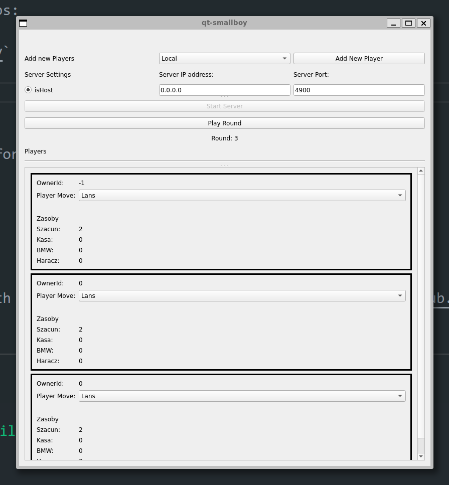

# About
It allows multiple clients to connect to a server and play the round based game "Mały dresiarz" together.

## Features

- **Client-Server Architecture**: The app follows a client-server architecture, where the server manages the game logic and multiple clients can connect to it.
- **Multiplayer Gameplay**: The app enables multiple players to connect to the server and play the game simultaneously.
- **Custom UI widget**: The project includes a custom widget for the Player class.
- **Slots and signals**: The app is based on custom slots/signals manner.
- **Cmake configuration and testing**: The project shows a simple example of a configured CMakelists file along with dependencies like *google tests* or qt::core.

## Getting Started

To get started with the Mały Dresiarz Client-Server App, follow these steps:

1. Clone the repository: `git clone https://github.com/nikpan1/qt-smallboy`
2. Create a build directory `mkdir -p build && cd build/`
3. Build the app: `cmake ../src/`
4. Run the client: `./qt-smallboy`

Make sure you have the necessary dependencies installed and configured before building and running the app.

## Preview

## Resources

The networking is based on a udemy course called - 'Qt 5 Core Advanced with C++' , visit the [GitHub repository](https://github.com/voidrealms/qt6-core-advanced/tree/main/section%204/qt6ca-4-32).
